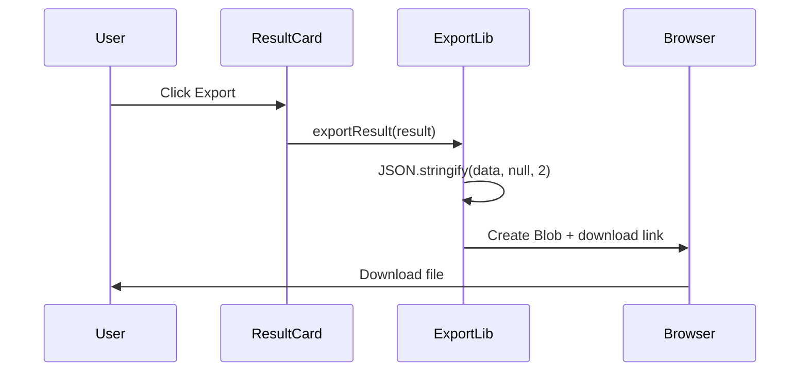

# Export Results - Design

## Architecture

### New Files
```
src/lib/
└── export.ts           # Export utilities
```

## Interface Specifications

### Export Functions
```typescript
// Export single result
function exportResult(result: AnalysisResult, filename: string): void

// Export multiple results
function exportAllResults(results: AnalysisResult[]): void

// Generate export data
function generateExportData(results: AnalysisResult[]): ExportData

interface ExportData {
  version: string
  exportedAt: string
  count: number
  results: AnalysisResult[]
}
```

## Data Flow



## Export Format
```json
{
  "version": "1.0",
  "exportedAt": "2024-01-15T10:30:00Z",
  "count": 1,
  "results": [
    {
      "filename": "photo.jpg",
      "tags": ["nature", "landscape"],
      "objects": [{"name": "mountain", "confidence": 0.95}],
      "colors": [{"hex": "#007ACC", "name": "Blue", "percentage": 40}],
      "mood": "serene",
      "scene": "outdoor daylight",
      "description": "...",
      "suggestedTitle": "Mountain Serenity"
    }
  ]
}
```

## Unit Testing Approach
- Test JSON structure is valid
- Test filename generation includes timestamp
- Test blob creation and download trigger
