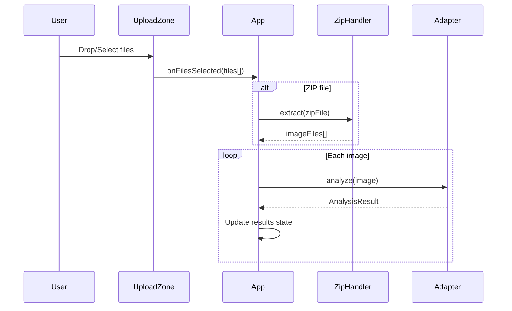

# Image Upload - Design

## Architecture

### Component Structure
```
src/
├── App.tsx                 # Main app with upload state
├── components/
│   └── UploadZone.tsx     # Drag-and-drop upload component (TODO)
└── lib/
    └── zip-handler.ts     # ZIP extraction utility (TODO)
```

## Data Flow



## Interface Specifications

### UploadZone Props
```typescript
interface UploadZoneProps {
  onFilesSelected: (files: File[]) => void
  isProcessing?: boolean
  acceptedTypes?: string[]  // default: ['image/*', '.zip']
}
```

### File Validation
```typescript
const isValidFile = (file: File): boolean => {
  return file.type.startsWith('image/') || file.name.endsWith('.zip')
}
```

## Error Handling
| Error | Handling |
|-------|----------|
| Invalid file type | Silently reject, don't add to queue |
| Empty ZIP | Show "No images found" message |
| Corrupt image | Mark as error in results grid |

## Unit Testing Approach
- Test drag-and-drop event handling
- Test file type validation
- Test ZIP extraction (mock JSZip)
- Test multi-file state management
