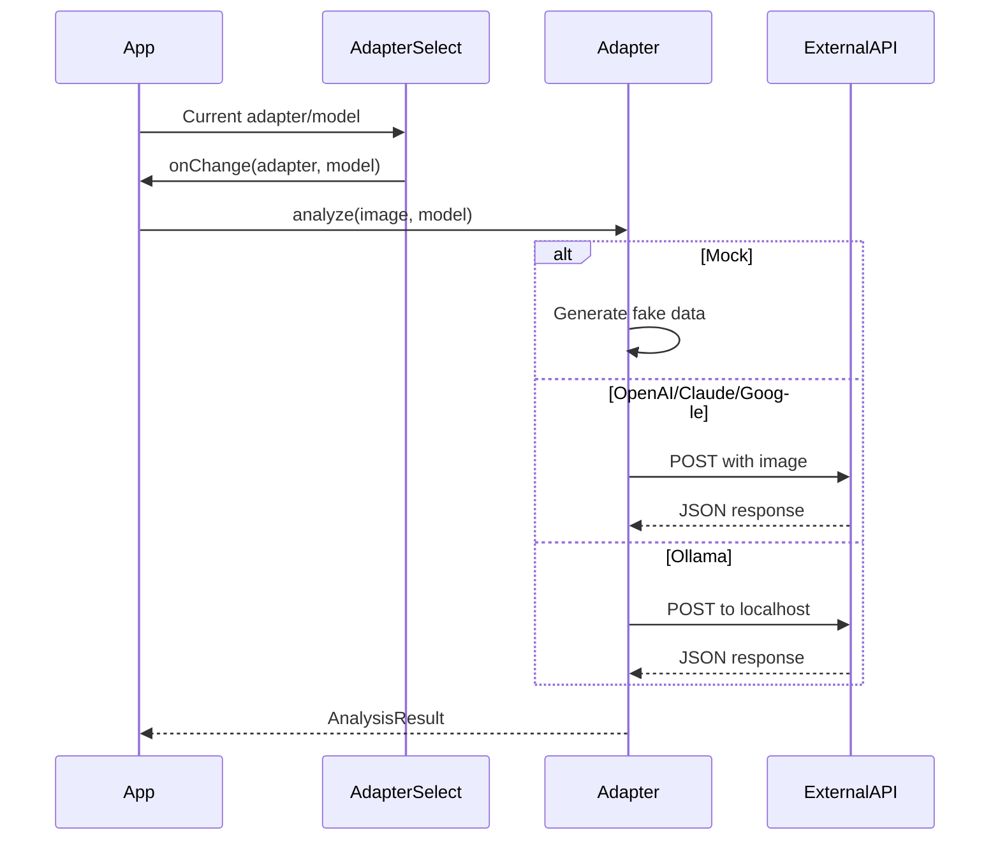

# Vision Adapters - Design

## Architecture

### Adapter Pattern
```
lib/adapters/
├── types.ts       # VisionAdapter interface, AnalysisResult
├── index.ts       # Exports
├── mock.ts        # Demo adapter
├── openai.ts      # OpenAI Vision
├── claude.ts      # Anthropic Claude
├── google.ts      # Google Gemini
└── ollama.ts      # Local Ollama
```

## Interface Specifications

### VisionAdapter Interface
```typescript
interface VisionAdapter {
  name: string
  models: string[]
  analyze(image: File | string, model: string): Promise<AnalysisResult>
  isConfigured(): boolean
}
```

### AnalysisResult Schema
```typescript
interface AnalysisResult {
  tags: string[]
  objects: Array<{ name: string; confidence: number }>
  colors: Array<{ hex: string; name: string; percentage: number }>
  mood: string
  scene: string
  description: string
  suggestedTitle: string
}
```

## Data Flow



## Prompt Engineering
All adapters use consistent prompt:
```
Analyze this image and return JSON:
{
  "tags": [...],
  "objects": [{name, confidence}, ...],
  "colors": [{hex, name, percentage}, ...],
  "mood": "...",
  "scene": "...",
  "description": "...",
  "suggestedTitle": "..."
}
```

## Error Handling
| Error | Handling |
|-------|----------|
| Invalid API key | Return error with helpful message |
| Rate limit | Retry with exponential backoff |
| Timeout | Abort after 60s, mark as error |
| Parse error | Return partial result if possible |

## Unit Testing Approach
- Mock adapter: Verify return structure
- Real adapters: Mock fetch, verify request format
- Error cases: Verify graceful degradation
